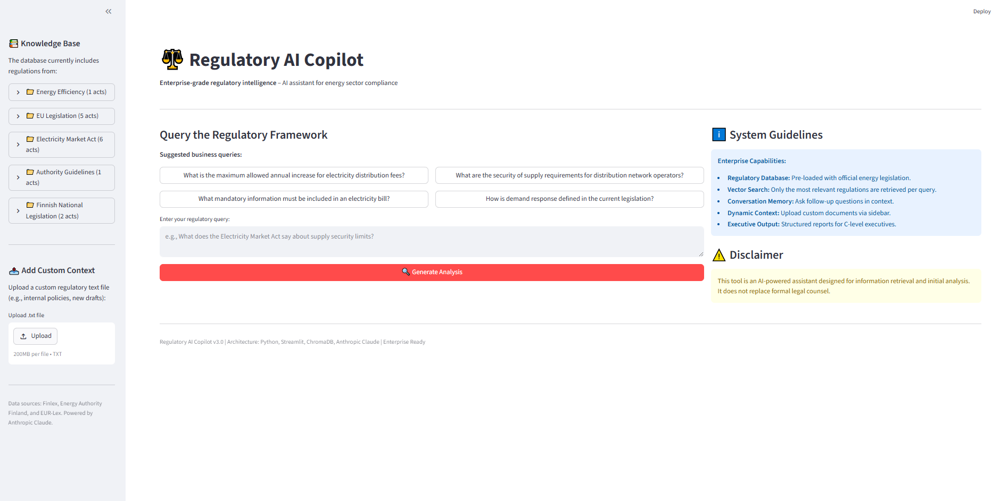
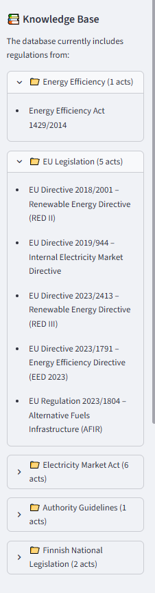
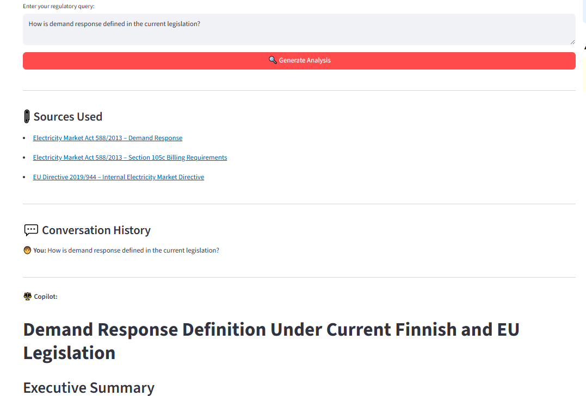
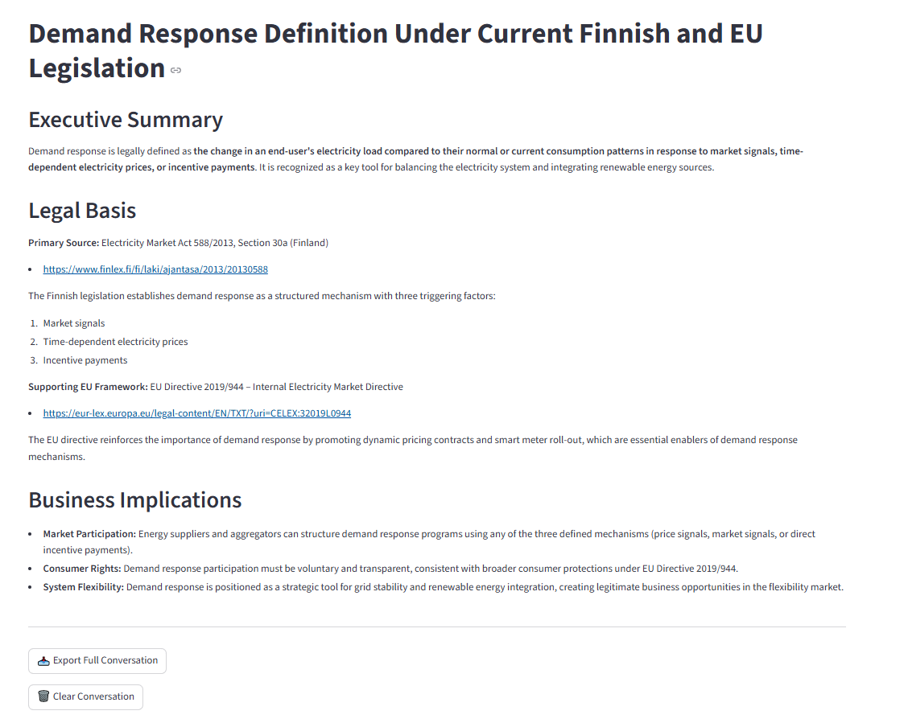

# Regulatory AI Copilot – Energy Sector

An enterprise-grade AI assistant for energy sector regulatory intelligence. Built with Python, Streamlit, ChromaDB, and Anthropic Claude API.

## What it does

Helps energy sector professionals quickly interpret complex Finnish and EU energy regulations. Instead of manually searching through legislation, users can ask questions in plain English and receive structured compliance reports with exact legal references.

## Features

- **Vector Search (ChromaDB)** – Retrieves only the most relevant regulations per query using semantic similarity
- **15 Regulations** from Finlex, EUR-Lex, Energy Authority Finland, and TEM
- **Conversation Memory** – Ask follow-up questions in context
- **Source Citations** – Every answer links directly to the original legislation
- **Custom Document Upload** – Upload internal policies or draft regulations as additional context
- **Export Reports** – Download full conversation as a text file

## Screenshots

### Main Interface


### Knowledge Base


### Example Query and Analysis


### Sources and Full Report


## Architecture

```
User Query
    →
ChromaDB Vector Search (retrieves 3 most relevant regulations)
    →
Claude API (analyzes and structures the response)
    →
Structured Compliance Report with Source Links
```

## Tech Stack

- **Python** – Core language
- **Streamlit** – Web interface
- **ChromaDB** – Vector database for semantic search
- **Sentence Transformers** – Embedding model (all-MiniLM-L6-v2)
- **Anthropic Claude API** – AI analysis and response generation

## Regulation Coverage

| Category | Count |
|----------|-------|
| Electricity Market Act | 6 |
| EU Legislation | 5 |
| Finnish National Legislation | 2 |
| Energy Efficiency | 1 |
| Authority Guidelines | 1 |

## Run Locally

```bash
pip install -r requirements.txt
export ANTHROPIC_API_KEY=your_key_here
streamlit run app.py
```

## Disclaimer

This tool is designed for information retrieval and initial analysis. It does not replace formal legal counsel.


